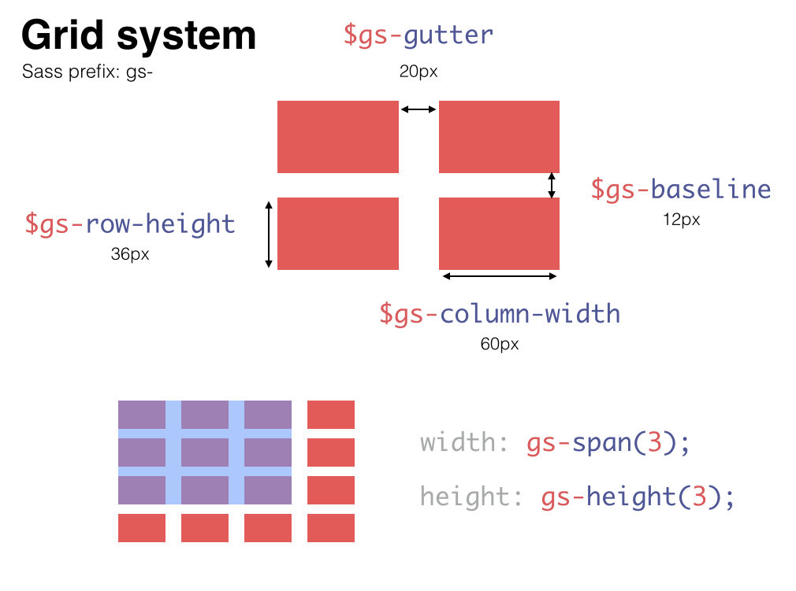

# Guss Grid System

Part of the [Guss](https://github.com/guardian/guss) collection.

## Installation

```
bower install guss-grid-system --save
```

```scss
@import "path/to/_grid-system.scss";
```


## Features

Provides Sass mixins and values for the Guardian grid system.




## Example

```scss
.element {
    width: gs-span(3);
    height: gs-height(4);
}
.custom-wrapper {
    @include gs-container;
}
```
